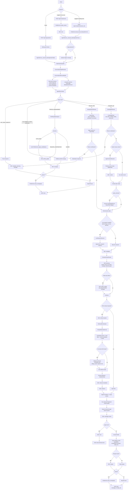

```mermaid
flowchart TD
  A["Client"] --> B{"Chat API"}

  B -->|"Guest"| C["POST /api/v1/guest/chat"]
  B -->|"Logged-in new room"| D["POST /api/v1/chat/rooms"]
  B -->|"Logged-in existing room"| E["POST /api/v1/chat/rooms/{room_id}"]

  C --> F["Build guest history"]
  D --> G["ChatService.create_room()"]
  G --> H["SSE: room"]
  E --> I["ChatService.load_recent_history(limit=10)"]

  F --> J["AgentService._execute_stream(persist=false)"]
  H --> K["AgentService._execute_stream(persist=true)"]
  I --> K

  J --> L["MainIntentClassifier"]
  K --> M{"Image attached?"}
  M -->|"yes"| N["Upload image to storage"]
  M -->|"no"| L
  N --> L

  L --> O["ConversationStateResolver"]
  O --> P["ConversationMemoryBuilder"]
  P --> Q["Short-term memory<br/>recent recipe ids<br/>recent ingredients<br/>current constraints"]
  P --> R["Long-term memory<br/>UserProfile allergies/preferences"]
  Q --> S["AgentRunContext"]
  R --> S

  S --> T{"Early route?"}
  T -->|"OFF_TOPIC / IDENTITY"| U["Fixed response"]
  T -->|"low confidence / needs clarification"| V["Clarification response"]
  U --> W["SSE: metadata, planning, message"]
  V --> W
  W --> X{"persist?"}
  X -->|"yes"| Y["ChatService.save_messages()"]
  X -->|"no"| Z["Skip DB save"]
  Y --> AA["SSE: done"]
  Z --> AA

  T -->|"PROFILE_MANAGEMENT"| AB["ProfileUpdateAnalyzer"]
  AB --> AC{"Decision"}
  AC -->|"AUTO_SAVE"| AD["UserProfileService.apply_candidates()"]
  AC -->|"REQUIRE_CONFIRMATION"| AE["SSE: profile_update"]
  AC -->|"IGNORE"| AF["Fallback profile message"]
  AD --> AE
  AE --> AG["SSE: message"]
  AF --> AG
  AG --> X

  T -->|"RECIPE_FIND"| BA["RecipeSearchPlanner"]
  BA --> BB["SearchPlan<br/>query, ingredients, constraints, sub_intent"]
  BB --> BC["Apply memory to SearchPlan"]
  BC --> BD{"Planner clarification?"}
  BD -->|"yes"| V
  BD -->|"no"| BE["Domain plan ready"]

  T -->|"COOKING_QA"| CA["CookingQAPlanner"]
  CA --> CB["CookingQAPlan<br/>sub_intent, strategy, safety, references"]
  CB --> CC{"Planner clarification?"}
  CC -->|"yes"| V
  CC -->|"no"| CD{"Needs recipe context?"}
  CD -->|"yes"| CE["AgentContextResolver"]
  CE --> CF["Resolve recent recipe id/title/index"]
  CF --> CG["SSE: context"]
  CD -->|"no"| CH["No context event"]
  CG --> CI["Domain plan ready"]
  CH --> CI

  CI --> CJ{"needs_retrieval?"}
  CJ -->|"yes"| CK["Convert CookingQAPlan to SearchPlan adapter"]
  CJ -->|"no"| BE
  CK --> BE

  BE --> DA{"Live research needed?<br/>planner flag or service decision"}
  DA -->|"yes"| DB["LiveResearchService"]
  DB --> DC["Append live research evidence"]
  DA -->|"no"| DD["Skip live research"]
  DC --> DE["SSE: metadata"]
  DD --> DE

  DE --> DF["DomainAnswerRouter"]
  DF --> DG["SSE: planning<br/>primary_task, sub_intent, strategy, selected_agent"]

  DG --> DH{"Profile side effect?"}
  DH -->|"yes"| DI["SSE: profile_update<br/>also prepend profile message"]
  DH -->|"no"| DJ["Continue"]
  DI --> DJ

  DJ --> DK{"RAG retrieval required?"}
  DK -->|"yes"| DL["SSE: retrieval started"]
  DL --> DM["RetrievalOrchestrator"]
  DM --> DN["RecipeRetrievalService"]
  DN --> DO["Embedding search + hard filters + lexical candidates + rerank"]
  DO --> DP{"No result with full plan?"}
  DP -->|"yes"| DQ["Fallback with hard constraints only<br/>allergy, avoid, required, time"]
  DP -->|"no"| DR["Use ranked results"]
  DQ --> DR
  DR --> DS["Recipe payloads + EvidencePack"]
  DS --> DT["SSE: retrieval completed"]
  DT --> DU["SSE: evidence"]
  DU --> DV["Append evidence + recipe context"]
  DK -->|"no"| DW["Skip RAG"]
  DW --> DV

  DV --> EA["Run selected PydanticAI answer agent"]
  EA --> EB["Stream chunks through asyncio queue"]
  EB --> EC["SSE: message chunks"]

  EC --> ED{"Agent error?"}
  ED -->|"yes"| EE["SSE: error"]
  EE --> EF["SSE: done terminal event"]

  ED -->|"no"| EG["AnswerVerifier"]
  EG --> EH["Check allergy, avoid ingredients,<br/>text/payload mismatch, safety risk"]
  EH --> EI{"Recipes found?"}
  EI -->|"yes"| EJ["SSE: recipes"]
  EI -->|"no"| EK["Skip recipes"]
  EJ --> EL{"persist?"}
  EK --> EL

  EL -->|"yes"| EM["ChatService.save_messages()"]
  EL -->|"no"| EN["Skip DB save"]
  EM --> EO["SSE: done<br/>message_id, recipe_ids"]
  EN --> EO
```
